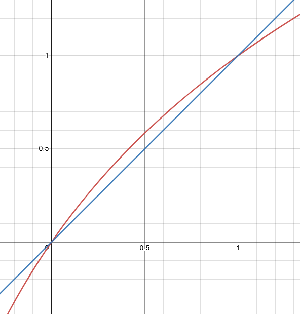

import NewtonMethodDemo from '@/components/PostComponents/FastInverseSqrt/NewtonMethodDemo.vue'
import FloatingPointDemo from '@/components/PostComponents/FastInverseSqrt/FloatingPointDemo.vue'

<note: TODO add thumbnail>

<FloatingPointDemo />
<NewtonMethodDemo id='test'/>

<note: TODO move this graph down>

> This article contains some profanity which is found in the original code. If you'd prefer to read a version without profanity or one to show kids.

$$
\frac{1}{\sqrt{x}}
$$

```c
float Q_rsqrt( float number )
{
	long i;
	float x2, y;
	const float threehalfs = 1.5F;

	x2 = number * 0.5F;
	y  = number;
	i  = * ( long * ) &y;         // evil floating point bit level hacking
	i  = `0x5f3759df` - ( i >> 1 ); // what the fuck?
	y  = * ( float * ) &i;
	y  = y * ( threehalfs - ( x2 * y * y ) );   // 1st iteration
//	y  = y * ( threehalfs - ( x2 * y * y ) );   // optional 2nd iteration

	return y;
}
```

Fast Inverse Square Root is one of the most famous algorithms in the world. But what makes it so iconic? How does the algorithm work? And where does `0x5f3759df` come from? All will be answered in this simple blog post.

## Why is this algorithm so iconic?

It's not often that you see swear words in official source code. And doing division without a single division operator! How's that even possible?!

The algorithm was originally found in the source code of Quake III Arena, attributed to the iconic John Carmack however it was later discovered to predate the game.

Finding the inverse square root of a number is important for normalizing vectors in computer graphics programs which is often required in lighting and shaders calculation. These computations are made thousands of times per frame so it is imperative to find a fast algorithm for them.

To naively find the inverse square root involves we must first find the square root of a number and then find its reciprocal. Both of those are complex operations that take a long time on old CPUs. On the other hand, the fast algorithm only requires multiplications, bit shifts, and subtraction, all of which can run much faster so it became the defacto method for computing inverse square roots.

Is it used today? Not really. Hardware advancements have made this pretty obsolete since many CPUs come with rsqrt instructions which can compute the inverse square root in a single instruction[^1].

# "Slow inverse square root"

[https://replit.com/@PreethamNaraya1/Slow-Inverse-Square-Root#main.c](https://replit.com/@PreethamNaraya1/Slow-Inverse-Square-Root#main.c)

```c
float S_rsqrt( float number, int iterations ) {
	long i;
	float x2, y;
	const float threehalfs = 1.5F;

	x2 = number * 0.5F;
	y  = 0.01; // initial value of y - the result that we're approximating
	for (int i = 0; i < iterations; i++) {
	  y  = y * ( threehalfs - ( x2 * y * y ) );
  }

	return y;
}
```

Here's my "slow" inverse square root algorithm.

Try running this algorithm. It's slower but it still works. You'll notice that smaller values for `number` result in more iterations.

**<note: insert graph of execution time + number of iterations here>**

(for extra credit, try tweaking the initial value of y to see how that impacts the convergence)

Unlike the normal method, this doesn't use any square root or division operations. However, it also doesn't use `0x5f3759df` or the "evil floating point hack". That's because those steps aren't even required. The core of this algorithm is using something called Newton's method.

## Newton's Method

There are plenty of great resources on what this method is and why it works

[Newton's method produces this fractal, why don't we teach it in calculus classes?](https://youtu.be/-RdOwhmqP5s?t=336)

TL;DW: It works by taking an approximation and iterating closer and closer to the actual value by riding the slope of the curve.

<NewtonMethodDemo id='1'/>

Here's a bunch of fancy math for completion's sake however you can skip to the [next section](#what-the-fuck-ie-choosing-a-better-initial-guess) if you're more interested in the where `0x5f3759df` comes from and the evil floating point bit level hack.

Let's say that x is our input and y is the inverse square root. We want to solve for the equation

$$
\begin{aligned}
y &= 1/sqrt(x)\\
\text{or } 0 &= 1/y^2 - x
\end{aligned}
$$

Newton's method can help us solve the roots of this equation for y. Remember that we're solving for y here. x is a constant input.

$$
\begin{aligned}
f(y) &= 1/y^2 - x \\
f'(y) &= -2y^{-3}
\end{aligned}
$$

To get the next iteration of y, we "ride the slope" of f(y) one step closer to its root.

$$
\begin{aligned}
f(y)_{next} &= y - f(y)/f'(y)\\
f(y)_{next} &= y - \frac{1/y^2 - x}{-2/y^3}\\
f(y)_{next} &= y + y/2 -xy^3/2\\
f(y)_{next} &= y(3/2 -xy^2/2)
\end{aligned}
$$

Which is how we get the code

```c
const float threehalfs = 1.5F;
x2 = number * 0.5F;

y = y * (threehalfs - x2 * y * y) // first iteration
```

And now we're doing an inverse square root without a single division operator! Isn't that exciting!

The important thing to note here is that Newton's method is just an approximation. The closer your initial guess, the fewer iterations you'll need. With "slow inverse square root" we often need more than 10 iterations to converge on the actual value. In the fast inverse square root algorithm, we get away with just a single iteration. So that's our next goal - choosing a better initial guess.

# "What the fuck?" ie, choosing a better initial guess

```cpp
i = `0x5f3759df` - ( i >> 1 )
```

The `i` on the left hand side is our initial guess `y` and the `i` on the right hand side is our original number `x`. So let's rewrite the code so we don't get confused between the two different values of `i`.

```cpp
y_bits = `0x5f3759df` - ( x_bits >> 1 )
```

One thing to note is that **$x_{bits}$ and $y_{bits}$ are the binary representations** of floating point numbers and not the numbers $x$ and $y$ themselves. Using the binary representation stored in integers allows us to do operations like subtraction (`-`) and bit shifting (`>>`). How we do this conversion will be explained in the next section on "evil floating point bit level hacking" but first we need to understand how IEEE floating point numbers work...

## How do IEEE floating point numbers work?

Floating point is a fancy way of saying binary scientific notation.

Just like regular scientific notation has numbers like $+1.6*10^{15}, -1.731*10^{-52}, +4.25*10^0$, floating point has numbers like $+1.101011*2^{11010}, -1.001101*2^{-101}, -1.001*2^{0}$

There are a few commonalities in both representations:

1. The numbers are split into a sign (+ or -), a coefficient (also called a mantissa), and an exponent. For example, $-1.731*10^{-52}$ can be split into
    * sign: $-$
    * coefficient: $1.731$
    * exponent: $-52$
2. The leading number is never zero. If it was, we could just shift the point to the first non-zero number and subtract from the exponent. For example, instead of $0.61*10^2$, we can write $6.1*10^1$

Using these two rules, we can write our floating point number as

$$
\begin{aligned}
x &= s*m*2^e
\end{aligned}
$$

To store this on a computer, we need to convert the $s$, $m$, and $e$ values into their binary representations `S`, `M`, and `E`

- s is the sign. If the sign bit `S` is 0 then the number is positive (ie, +1). 1 means negative (ie, -1). For the purposes of inverse square root x will always be positive (you can't take square roots of negative numbers in the "real" world), `S` will always be 0. We'll just ignore it for the rest of this post.
- m is the mantissa. Since the leading digit of a floating point number is always a 1 in binary, the 1 is implied and `M` is just the fractional part after the point (ie, m = 1 + `M`)
    - Astute readers might notice that if the mantissa is 0 then we can't avoid a leading 0, the floating point standard handles this in an interesting way but since the inverse of 0 is undefined, we'll just ignore it for the rest of this post.
- e is the exponent. To store positive and negative exponents, we take the unsigned 8 bit exponent value (`E`) and subtract 127 to get a range from -127 to +128. This allows us to store tiny numbers smaller than 1 using negative exponents and large numbers bigger than 1 using positive exponents.

Putting all those constraints together, we get the following equation for our floating point number x in terms of the binary representations of `S`, `M`, and `E`

$$
\begin{aligned}
x &= S*(1 + M)*2^{E-127}\\
x_{bits} &= 2^{23}*(E+M)
\end{aligned}
$$

Try playing around with this floating point number calculator to create floating point numbers of your own!

<FloatingPointDemo />

### Working with logarithms

Working with exponents is tricky and confusing. Instead, by taking the logarithm, we turn confusing division, multiplication, and exponent operations into simple subtraction, addition, and multiplication.

It turns out that working with logarithms also allows us to find a relationship between the binary representation of x ($x_{bits}$) and the number $x$.

If you squint really hard then you can see that taking the log of x will bring the exponent value down and with some scaling and shifting, it's proportional to $x_{bits}$. Fortunately, we don't have to squint.

$$
\begin{aligned}
x_{bits} &= 2^{23}*(E + M)
\end{aligned}
$$

Meanwhile

$$
\begin{aligned}
x &= m*2^e\\
\implies log_2(x) &= e + log(m)\\
&= E - 127 + log(1+M)
\end{aligned}
$$

Through another fortunate quirk of logarithms, we see that [$x \approxeq log(1+x)$](https://www.desmos.com/calculator/dd1xqmj6cp) for small values of x between 0 and 1. In other words, $x = log(1+x) + \varepsilon$ where $\varepsilon$ is a small error term.



Putting all of this together, we get

$$
\begin{aligned}
log_2(x) &= E-127+log(1+M)\\
&=E-127+M+\varepsilon\\
&=2^{23}*(E+M)/2^{23}-127+\varepsilon\\
&=x_{bits}/2^{23}-127+\varepsilon\\
\end{aligned}
$$

So now we have a mathematical relationship between the binary representation of x and log(x).

## What is `0x5f3759df`

Using logarithms allows us to turn $y = 1/x^{1/2}$ into $log(y) = -\frac{1}{2}log(x)$.

From here, we can use the relationship we found earlier to relate the binary representations of x and y.

$$
\begin{aligned}
&y = 1/x^{1/2}\\
\implies &log(y) = -\frac{1}{2}log(x)\\
\implies &y_{bits}/2^{23} - 127 + \varepsilon = -\frac{1}{2}(x_{bits}/2^{23} - 127 + \varepsilon)\\
\implies &y_{bits} = \frac{3}{2}2^{23}(127 - 
ε) - x_{bits}/2
\end{aligned}
$$

Or in other words

```c
y_bits  = `0x5f3759df` - ( x_bits >> 1 );
```

$\frac{3}{2}2^{23}(127 - \varepsilon)$ gets us the magic number `0x5f3759df` and $-x_{bits}/2$ gets us `-(x_bits >> 1)`

If we ignore the error term ε and plug the magic number equation into [WolframAlpha](https://www.wolframalpha.com/input?i=%5Cfrac%7B3%7D%7B2%7D2%5E%7B23%7D%28127%29) we get 1598029824. And that's [equal to](https://www.wolframalpha.com/input?i=%5Cfrac%7B3%7D%7B2%7D2%5E%7B23%7D%28127%29+in+hex) … 0x5f400000? So where did they get `0x5f3759df` from?…

Most likely from the ε… I guess we're going on another tangent

## Optimizing ε with Minimaxing

Minimaxing is a lot like what it sounds like. In this case, we want to minimize the maximum error - in other words, find the constant C for which `Q_rsqrt` gives the smallest error compared to the actual inverse square root when considering all possible values of x_bits.

Since there are about 2 billion values of x and another 4 billion values of C, we'll need to do some optimization if we want this to finish running before the sun consumes the solar system.

1. In the previous step, we approximately narrowed down C to 0x5f400000. So we only need to search between 0x5f300000 and 0x5f500000.
2. Instead of searching all values of x, we can ignore the exponent and only search for all values of the mantissa because ε only comes up in the equation $\text{M} = log(1 + \text{M}) + \varepsilon$. If we optimize ε for one exponent value, it's optimized for all exponent values.
3. Instead of searching values of C one by one, we can narrow down the value of C digit by digit, working in increments of 0x10000, then 0x1000 and so on until all digits are found. This way, we only check around 160 values of C instead of 2 million.

That gives us the following pseudocode:
```c
cMin, cMax =  0x5f300000, 0x5f500000
delta = 0x10000
while (delta > 0):
	minMaxError, minMaxC = 10000, cMin
	for each C between cMin and cMax in increments of delta:
		for each mantissa value M:
			x = 0x3F000000 + M // x in [0.5,2) with mantissa M
			y = Q_rsqrt(x, C)
			z = sqrt(x)
			error = abs(1 - y * z) // relative error
			if (error > minMaxError):
				minMaxError = error
				minMaxC = C
	// narrow down the range of cMin to cMax
	// and use smaller increments for delta
	cMin = minMaxC - delta
	cMax = minMaxC + delta
	delta = delta >> 4

return minMaxC
```
[Try running the actual code for yourself](https://replit.com/@PreethamNaraya1/Minimaxing#main.c). You can try playing around with different ranges of values, different deltas, or different numbers of iterations to see how that impacts the result.

And now we get... `0x5f375a87`. This is still quite different from the constant found in the original code. At this point I was stumped. According to the math and tests, this approximation is better than `0x5f3759df`.

<note: show a video or graph of how the optimization process runs>

<note: show graphs that prove that our constant is better>

<note: figure out for what values we get the closest approximations when doing zero iterations. maybe add another graph.
Also try a graph where we use a bunch of different values for magic numbers and see how each magic number performs on different values of x>

So if `0x5f375a87` works better then why does Quake use `0x5f3759df`? Perhaps, `0x5f3759df` works better with the numbers that Quake deals with. Perhaps the developer used a different method to generate this number. Perhaps it was simply pulled out of someone's rear. Only the person who wrote this code knows why `0x5f3759df` was chosen instead.

Now brute forcing it might be a bit unsatisfying for you. Maybe you wanted a mathematically rigorous way to narrow it down to the precise bit. Unfortunately, the math is somewhat out of scope for this article. However, there are some great papers by Chris Lomont and others that prove this (and find even better constants) using a lot of algebra and piecewise equation optimizations if you're into that stuff.

[Fast Inverse Square Root - Chris Lomont](http://www.lomont.org/papers/2003/InvSqrt.pdf)

[A Modification of the Fast Inverse Square Root Algorithm](https://www.preprints.org/manuscript/201908.0045/v1)

# Evil floating point bit level hack

```c
y  = number;
i  = * ( long * ) &y;    // evil floating point bit level hacking
...
y  = * ( float * ) &i;
```

In order to do the magic from the previous step, we need to work with the binary representation of numbers (x_bits and y_bits) instead of the floating point numbers (x and y) themselves.

C allows you to convert between floats and longs using type casting. However, if you type cast a float to a long normally, then you would do the sensible thing and, for example, convert a float storing 3.33 into a long storing 3.

Float 3.33 stored in Binary is 01000000010101010001111010111001

Long 3 stored in Binary is 00000000000000000000000000000011

Clearly these are very different and wouldn't help us when our equation from the previous step depends on x_bits. What we instead want is a long that's storing 01000000010101010001111010111001 (1079320249 in decimal).

<NOTE: describe how memory is stored in computers a little more (maybe with some images)>

In order to do that, we need to trick the computer into interpreting the floating point bits as long bits. We can do this by telling the computer that this float pointer (`&y`) is actually a long pointer (type casting using `(long *)`) and then dereferencing that value into a long variable (`*`). That's what this line is doing (reading right to left): `i = * (long *) &y;`

Going back from i to y is just a reverse of the previous steps: convert the long pointer (`&i`) into a float pointer (`(float *)`) and dereferencing that value into a float variable (`*`). So we get `y = * ( float * ) &i;`

<note: potentially add some images showing the C memory representation>

# Putting it all together

My favorite way to learn is by taking something that works and tweaking it slightly to see how that changes things. So let's implement a version that works on 64 bit floating point numbers!

<note: TODO. also the Chris Lomont paper already does this so we're not doing anything new. Think of another idea>

To recap, the big leaps of logic for me were:

- Using Newton's method to do divisions using multiplication operations.
- Realizing the relationship between the floating point bit representation of x and log(x).
- Using log(x) and some basic algebra to get a close approximation for y.
- Using minimaxing to choose a better error term.
- Pointer magic to convert from float to long without changing any bits.

When I started looking into this topic I didn't think it would lead me to calculus, solving optimization problems, the binary representation of floating point numbers, and memory management inside computers. I think that's what I enjoyed most about it. Any one of these ideas is interesting and millions of students learn about them every year, but to put them all together to solve a completely unrelated problem in vector graphics requires someone with a very specific set of skills.

<note: insert venn diagram intersection of a ton of different skills>

What problems can you solve with your specific set of skills?

<note: TODO: add footnotes and extra reading / references section>

[^1]: [This article](https://www.linkedin.com/pulse/fast-inverse-square-root-still-armin-kassemi-langroodi/) goes into more detail and shows benchmarks.