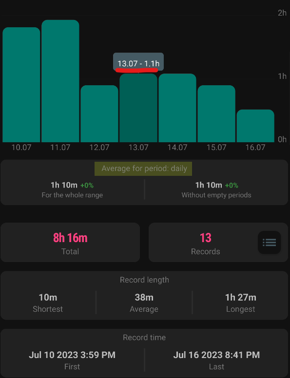
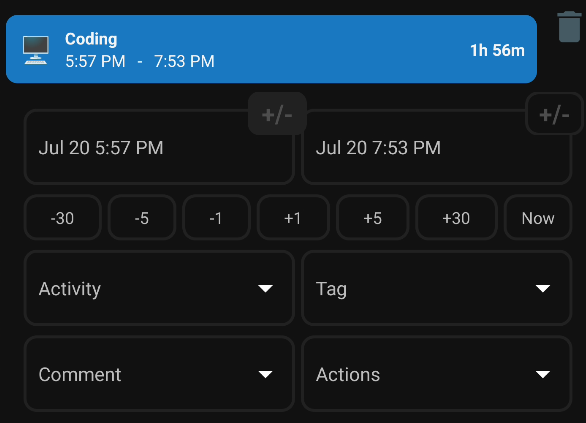

One of the things that I love about programming is that you can see a problem in the world and solve it. When I had trouble getting into one of my college classes, I wrote a web scraper that would look at the class catalog for open seats and notify me when a spot came up so I could quickly register. When there wasn't a website for some niche Pokemon specific information, [I made one myself](https://www.preethamrn.com/pokemondens/) ([and it went a little viral](https://www.reddit.com/r/PokemonSwordAndShield/comments/es50l6/update_interactive_map_of_the_wild_area_with_list/)).

So when I found out that one of the [apps](https://play.google.com/store/apps/details?id=com.razeeman.util.simpletimetracker) I used on a daily basis was [open source](https://github.com/Razeeman/Android-SimpleTimeTracker), I was pleasantly surprised. This app allowed you to track how you spent every second of your day. I love data and I love procrastination so this was perfect for me - I get to analyze how I spend my time and clamp down on the ways that I procrastinate mindlessly.

But there were 2 issues that bothered me:
1. The date format used "day/month" instead of "month/day". I've lived in India and the US so I'm familiar with both and each have their merits[^1] but I'm used to month/day right now so I wished there was a setting for it.
2. The app allows you to filter for activities in a specific time range. However, if an activity exceeds the time range then it doesn't clamp it to the specified time range. I don't need to know that I spent 30 minutes watching YouTube, 30 minutes reading, and 8 hours sleeping for the activities between 12am and 2am.

Now I could actually fix them. On the other hand, I was a little bit daunted. Even though this wasn't the Linux kernel or anything like that it would still be my first time contributing a real change to some open source codebase and I didn't want to make a fool of myself.

This post will go over issue #1 - Supporting month/day formatting in the bar chart.



Step one was figuring out where the date formatting code even was[^2]. Generally when I'm doing this, I first try to get a grip onto the code by diving deep into it. I look for the tiniest thing that I can recognize and try to work my way around that to see how it fits in.

In this case, that was the string "Average for period" you can see in the image above
Searching for it led me to this code:
```xml
<string name="statistics_detail_range_averages_title">Average for period: %s</string>
```

And searching for the resource name got me this:
```kotlin
private fun getRangeAverages(  
    data: List<ChartBarDataDuration>,  
    ...
): Pair<String, List<StatisticsDetailCardViewData>> {
...
val title = resourceRepo.getString(  
    R.string.statistics_detail_range_averages_title,  
    mapToGroupingName(chartGrouping)  
)
...
}
```

Great. Now I have to learn Kotlin as well... Fortunately I already know Java and Kotlin isn't that far off. And once I get the hang of Kotlin I'll be glad is isn't Java.

Following the call stack up we get: `getRangeAverages` -> `mapToChartViewData` -> `getChartViewData` -> `loadChartViewData` -> `updateChartViewData` ... I think we've probably gone a bit too far here.

`getChartViewData` seemed interesting. One of the methods it used - `getRanges` returned a list of `ChartBarDataRange`
```kotlin
private fun getRanges(  
    currentChartGrouping: ChartGrouping,  
    currentChartLength: ChartLength,  
    rangeLength: RangeLength,  
    rangePosition: Int,  
    firstDayOfWeek: DayOfWeek,  
    startOfDayShift: Long,  
): Pair<List<ChartBarDataRange>, CompositeChartData>
```

The `ChartBarDataRange` had a `legend` field which (assuming we were talking about the same legend) was exactly what I needed to update.
```kotlin
class ChartBarDataRange(  
    val legend: String,  
    val rangeStart: Long,  
    val rangeEnd: Long  
)
```

After that it was just a matter of finding out where the legend was set.
```kotlin
val legend = timeMapper.formatShortDay(calendar.timeInMillis)
```

Bingo.
The `formatShortDay` method was extremely simple. It just formatted a time using the `dd.MM` format. All I needed to do was change this to `MM.dd`.
```kotlin
private val shortDayFormat by lazy { SimpleDateFormat("dd.MM", locale) }

fun formatShortDay(time: Long): String = synchronized(lock) {  
    return shortDayFormat.format(time)    
}
```

But obviously I couldn't just break something that was already working or else no one would accept my pull request. Maybe some people actually prefer the `dd.MM` format. So I had to go on another journey to figure out how to add user preferences.

One surprisingly long and significantly less interesting[^3] expedition later and I ended up with this:
```kotlin
private val shortDayFormatMMDD by lazy { SimpleDateFormat("MM.dd", locale) }  
private val shortDayFormatDDMM by lazy { SimpleDateFormat("dd.MM", locale) }

fun formatShortDay(time: Long, useMonthDayTimeFormat: Boolean): String = synchronized(lock) {  
    if (useMonthDayTimeFormat) {  
        return shortDayFormatMMDD.format(time)  
    } else {  
        return shortDayFormatDDMM.format(time)  
    }  
}
```

If you want to see the full pull request you can [check it out on Github](https://github.com/Razeeman/Android-SimpleTimeTracker/pull/118). One day later[^4] and it was merged with the comment.


This seemed like a relatively simple change but I won't lie, it took me at least 2 hours to pull it off. I know that because I tracked my time.



To give a rough timeline:

1. First I cloned the repo and got the application running on my device
2. Then I used specific string and other details to find the activity and class where the relevant time formatting code was located
3. I quickly replaced the existing time format with my own to see if this would fix the issue on my device. It did. 
4. I found all the places where the time formatting was referenced and ensured I didn't break any of those
5. I removed my quick fix and instead locked my change behind a setting that could be toggled and added code that allowed users to toggle that preference
6. I forked the repo, pushed my changes to a feature branch, and submitted a pull request
7. The change was approved and merged.

All things considered the process went a lot more smoothly than I expected. I'm definitely going to contribute more in the future and I'd recommend you all to as well.

I mentioned 2 issues earlier but this post is already getting quite long so I'll leave it at that. Part 2 coming soon. If you want to get a sneak peak, check out the [second pull request](https://github.com/Razeeman/Android-SimpleTimeTracker/pull/119) as well - slightly less likely to get merged but at least I'll be able to use the code for myself.

[^1]: I say that each has their merits but if I'm being honest, I have no idea why you would use day/month. I know people say that it's better because it's in order - you go day/month/year from smallest to largest. But that means that when you try sorting days in lexicographical order, you get 11/01/2022 before 13/07/2005 which makes absolutely no sense. I think most people would agree than year/month/day is the best format because that sorts really well. And if you exclude the year then you get month/day which is perfect! And yeah month/day/year is a weird format too but at least if the year is all the same (eg. if you have a separate folder for all 2023 files) then you get the nice sorting property again.

[^2]: Step one was actually cloning the repo, installing Android Studio, fixing random issues with gradle, finding out that for some reason I was using a 32 bit version of Java in Android Studio, and making sure that I was able to even run the thing on my phone. But all that is less interesting than the actual process of diving into a massive, unfamiliar codebase.

[^3]: Most of the expedition was going through a bunch of different parts of the code to add a new preference for `useMonthDayTimeFormat`, a new checkbox to allow toggling the preference, UI event hooks so that everything behaves properly when the checkbox is checked, and refactoring a bunch of method signatures so we're able to pass the preferences down to where they're actually used.

[^4]: I double checked this after writing the blog and turns out it was even faster. Within 3 hours the pull request was reviewed and merged.